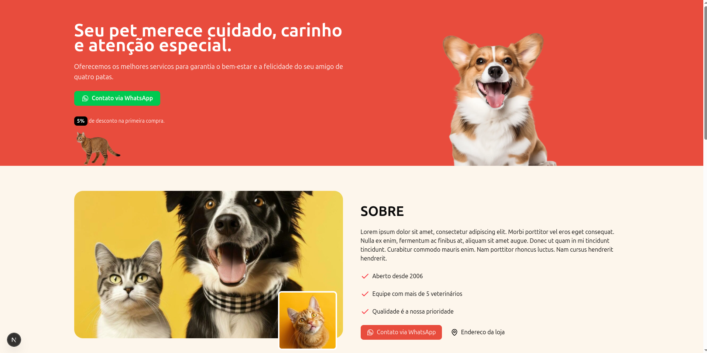

# Pet Shop Dev

Landing page moderna e responsiva para pet shop, desenvolvida com Next.js, React, TypeScript e Tailwind CSS. O projeto apresenta os serviços, depoimentos de clientes, marcas parceiras e facilita o contato via WhatsApp.

## ✨ Demonstração



## 🚀 Tecnologias Utilizadas

- [Next.js](https://nextjs.org/)
- [React](https://react.dev/)
- [TypeScript](https://www.typescriptlang.org/)
- [Tailwind CSS](https://tailwindcss.com/)
- [Embla Carousel](https://www.embla-carousel.com/)
- [Phosphor Icons](https://phosphoricons.com/)
- [Lucide React](https://lucide.dev/)
- [AOS (Animate On Scroll)](https://michalsnik.github.io/aos/)

## 📂 Estrutura do Projeto

```
├── public/
│   └── [imagens e assets estáticos]
├── src/
│   └── app/
│       ├── _components/
│       │   ├── about.tsx
│       │   ├── hero.tsx
│       │   ├── footer.tsx
│       │   ├── services.tsx
│       │   ├── testimonials.tsx
│       │   └── aos-init.tsx
│       ├── components/
│       │   └── ui/
│       │       └── button.tsx
│       └── lib/
│           └── utils.ts
├── package.json
├── tailwind.config.js
├── tsconfig.json
└── README.md
```

## 🐾 Funcionalidades

- **Seção Hero**: Chamada principal, imagem de destaque e botão para contato via WhatsApp.
- **Serviços**: Lista de serviços (Banho & Tosa, Consulta Veterinária, Táxi Pet, Hotel para pets) com ícones, descrição, preço e botão de contato.
- **Depoimentos**: Carrossel de depoimentos reais de clientes.
- **Sobre**: Informações institucionais, diferenciais e história do pet shop.
- **Marcas Parceiras**: Logos das principais marcas de produtos para pets.
- **Footer**: Contatos, redes sociais e informações da loja.
- **Animações**: Efeitos de entrada com AOS.
- **Responsividade**: Layout adaptado para todos os dispositivos.

## 📦 Instalação e Uso

1. **Clone o repositório:**

```bash
git clone https://github.com/seu-usuario/petshop-dev.git
cd petshop-dev
```

2. **Instale as dependências:**

```bash
npm install
# ou
yarn install
```

3. **Inicie o servidor de desenvolvimento:**

```bash
npm run dev
# ou
yarn dev
```

4. **Acesse:**

Abra [http://localhost:3000](http://localhost:3000) no navegador.

## 📝 Customização

- Altere as imagens em `public/` para personalizar com fotos do seu pet shop.
- Edite os textos e serviços nos componentes em `src/app/_components/`.
- Atualize os links de WhatsApp e redes sociais para os contatos reais da sua loja.

## 📄 Licença

Este projeto está sob a licença MIT. Veja o arquivo [LICENSE](LICENSE) para mais detalhes.

---

Desenvolvido com ❤️ por [Seu Nome](https://github.com/seu-usuario)
